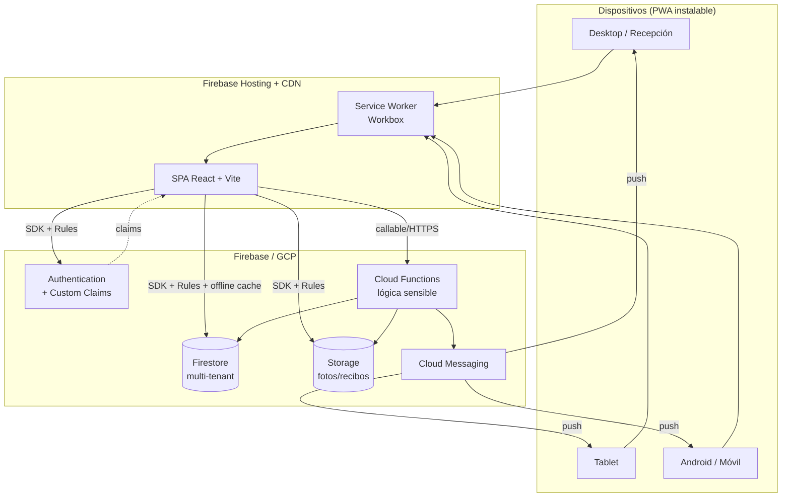

# 02 · Arquitectura del sistema

> Entregable 4. Vista de alto nivel de todo el sistema.

## 1. Diagrama de contexto

## 2. Principios arquitectónicos

1. **Client-heavy, server-authoritative.** El SDK de Firestore lee/escribe
   directo desde el cliente (rápido, offline, menos backend que mantener), pero
   **toda regla de negocio sensible vive en el servidor**: Firestore Rules
   validan forma y permisos; Cloud Functions ejecutan lo que no se puede
   confiar al cliente (cobros, cierre de caja, cambios de rol, contadores).
2. **Feature-based + Clean Architecture** en el frontend (ver doc 08). La lógica
   de negocio nunca vive dentro de componentes React.
3. **Repository Pattern** como frontera entre dominio y Firestore. Ningún
   componente ni hook de UI importa `firebase/firestore` directamente.
4. **Multi-tenant por diseño** (ver doc 04 y 05): `organizationId` en el custom
   claim y en la ruta de datos; las Rules lo hacen infranqueable.
5. **Offline selectivo, no total** (ver doc 10): asistencia/check-in offline;
   dinero online.

## 3. ¿Por qué Firebase? (y sus límites, honestamente)

**A favor (para este caso):**

- Offline-first nativo de Firestore = el check-in resiliente casi gratis.
- Auth + claims resuelve multi-tenant y roles sin backend propio de sesiones.
- Cero servidores que operar → margen SaaS alto y equipo pequeño.
- Escala horizontal automática hasta muy lejos para este patrón de carga.

**Límites que aceptamos y mitigamos:**

- **Firestore no hace agregaciones baratas.** `count()`/sumas sobre miles de
  docs son caras y lentas. → **Mitigación:** contadores y rollups mantenidos por
  Cloud Functions (patrón de agregación incremental). Reportes pesados → export
  a BigQuery en Fase 5.
- **Consultas limitadas** (sin joins, sin OR complejos históricamente). →
  **Mitigación:** desnormalización deliberada y justificada (doc 04) + índices
  compuestos declarados en `firestore.indexes.json`.
- **Vendor lock-in.** → **Mitigación:** el Repository Pattern aísla Firestore
  detrás de interfaces de dominio; migrar de motor toca 1 capa, no toda la app.

## 4. Entornos

| Entorno   | Uso                                                  | Proyecto Firebase |
| --------- | ---------------------------------------------------- | ----------------- |
| `local`   | Emulator Suite (Auth, Firestore, Functions, Storage) | emuladores        |
| `staging` | QA, pruebas de reglas, demo                          | `gymbar-staging`  |
| `prod`    | Producción                                           | `gymbar-prod`     |

Todo cambio pasa por emuladores → staging → prod. Las Firestore Rules se testean
en CI contra los emuladores **antes** de desplegar.

## 5. Vista de despliegue

- **Hosting:** SPA + service worker, cache-first para assets, network-first para
  navegación. Actualizaciones silenciosas (ver doc 10).
- **Functions:** región única cercana al mercado objetivo (ej. `us-central1` o
  `southamerica-east1`), organizadas por dominio (`payments`, `cashbox`,
  `membership`, `admin`).
- **CI/CD:** GitHub Actions → lint + typecheck + tests + rules-tests → deploy a
  staging en cada merge a `main`; deploy a prod con tag/manual approval.
