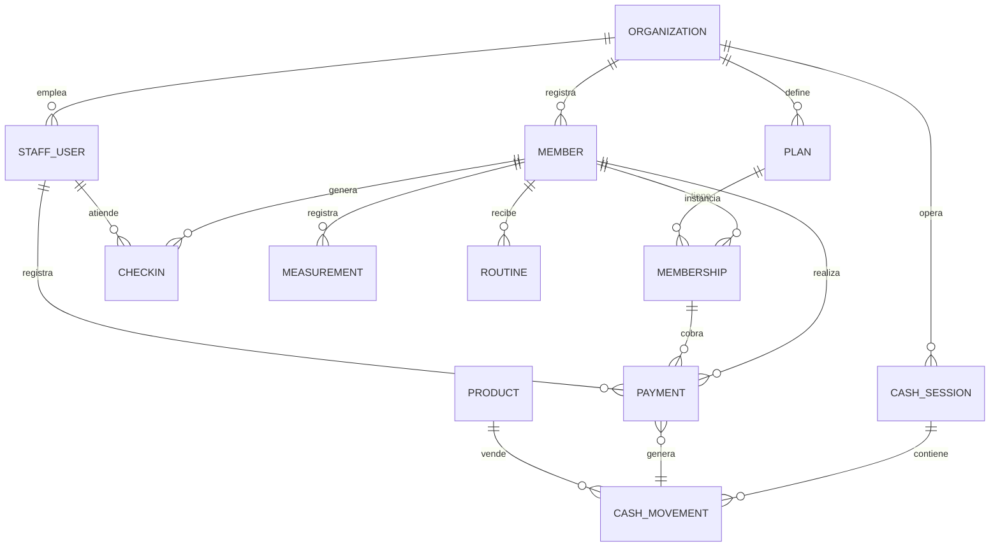
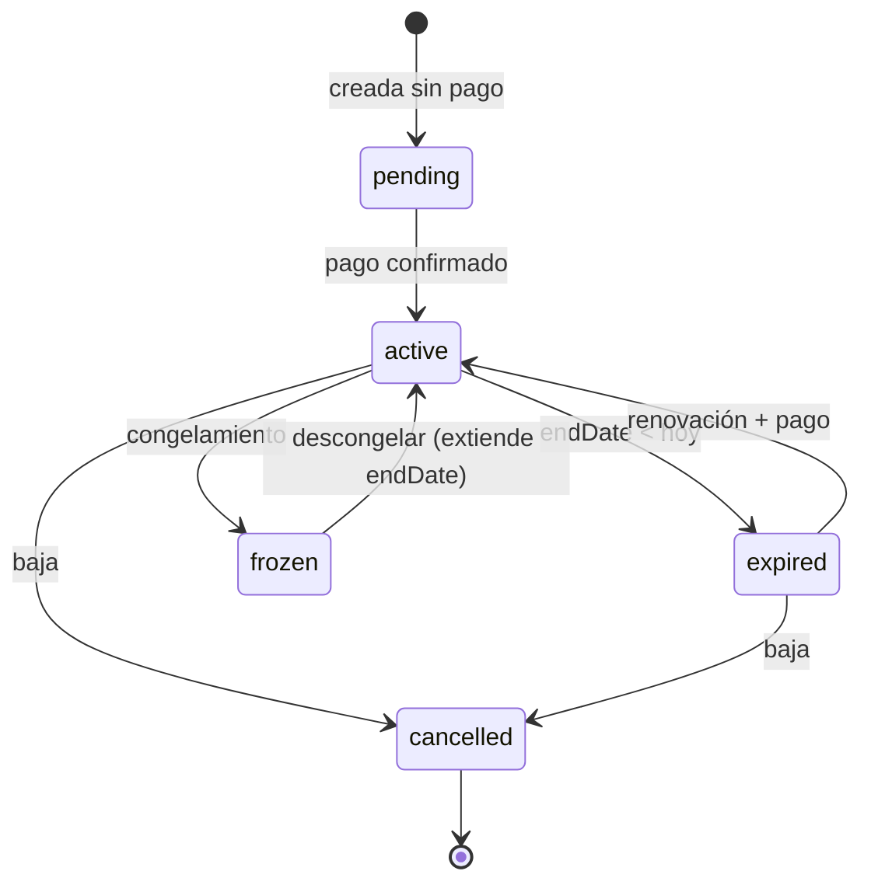

# 03 · Modelo de dominio

> Entregable 5. Lenguaje ubicuo y entidades del negocio (independiente de Firestore).

## 1. Lenguaje ubicuo (glosario)

- **Organization (Tenant):** un gimnasio (o cadena). Frontera de aislamiento.
- **Member (Cliente):** persona que asiste al gimnasio.
- **Plan:** definición comercial de una membresía (precio, duración, tipo).
- **Membership:** instancia de un Plan asignada a un Member, con vigencia.
- **CheckIn (Entrada):** registro de acceso de un Member en un instante.
- **Payment (Pago):** transacción de cobro asociada a un Member/Membership.
- **CashSession (Caja):** turno de caja con apertura, movimientos y cierre.
- **CashMovement:** ingreso o egreso dentro de una CashSession.
- **Routine (Rutina):** plan de entrenamiento asignado por un Trainer.
- **Measurement (Medida):** registro de medidas corporales en el tiempo.
- **Product / InventoryItem:** artículo vendible / stock.
- **StaffUser:** usuario del sistema (Admin, Recepcionista, Entrenador).

## 2. Diagrama de entidades

## 3. Invariantes de dominio (reglas que nunca se rompen)

Estas se aplican en **servidor** (Rules + Functions), nunca solo en el cliente:

1. Toda entidad pertenece a **exactamente una** Organization; jamás se lee/escribe
   fuera de su `organizationId`.
2. Un Member **activo** tiene ≥ 1 Membership con `status = active` y `endDate ≥ hoy`.
3. Un CheckIn solo se **permite** (no se bloquea el registro, se etiqueta el
   resultado) según el estado de la membresía → ver §4.
4. Un Payment **inmutable** una vez creado (correcciones = movimiento de ajuste,
   no edición). Trazabilidad contable.
5. Una CashSession **abierta** por punto de venta a la vez. El cierre calcula
   `expected = apertura + ingresos - egresos` y registra la diferencia.
6. El monto de caja del día debe **cuadrar** con la suma de Payments del turno.

## 4. Máquina de estados de Membership

Estados visuales derivados (para UI, doc 07): `active`, `expired`, `pending`,
`frozen`, `cancelled`. El **acceso** (check-in) se decide así:

| Estado membresía | ¿Registrar entrada? | Etiqueta UI |
|---|---|---|
| active (al día) | Sí, verde | "Acceso permitido" |
| active con pago pendiente | Sí, con aviso | "Pago pendiente" |
| expired | Sí pero marcado | "Vencido — renovar" |
| frozen | No por defecto (config) | "Congelada" |
| cancelled | No | "Sin membresía" |

> Decisión no complaciente: el check-in **registra siempre** el intento (dato
> valioso) y **decide el acceso por política configurable**, en vez de bloquear
> en duro. Bloquear en duro genera colas y fricción; el gimnasio decide su política.

## 5. Value Objects clave

- **Money:** entero en la unidad menor (centavos) + `currency`. **Nunca floats**
  para dinero. Se formatea solo en UI.
- **DateRange:** `{ startDate, endDate }` con helpers de vigencia.
- **PhoneNumber / MemberCode:** normalizados para búsqueda (índice en minúsculas/E.164).
- **MembershipStatus / PaymentMethod / Role:** enums cerrados validados por Zod y Rules.
