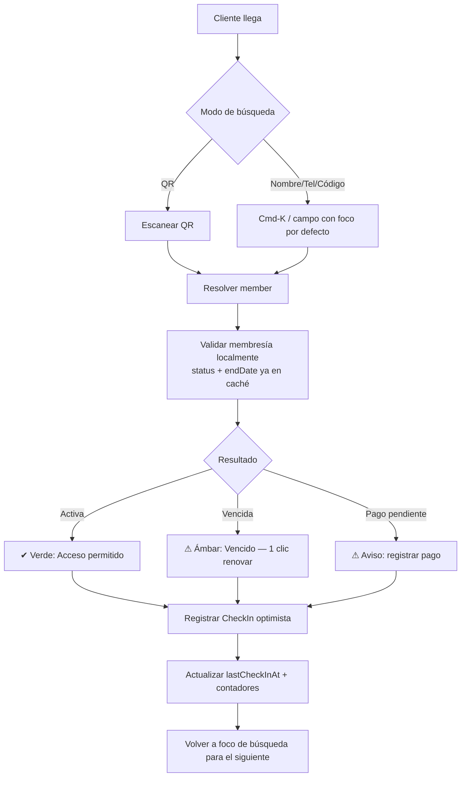
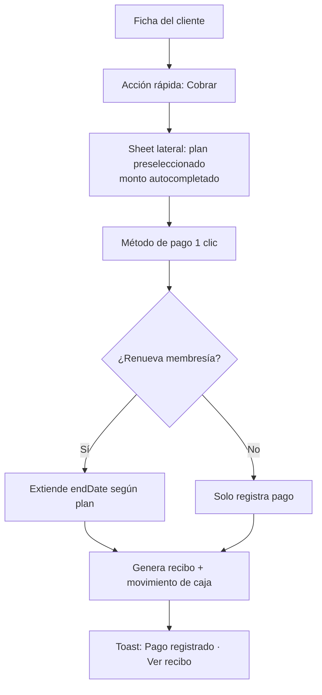
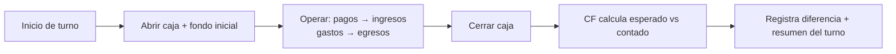
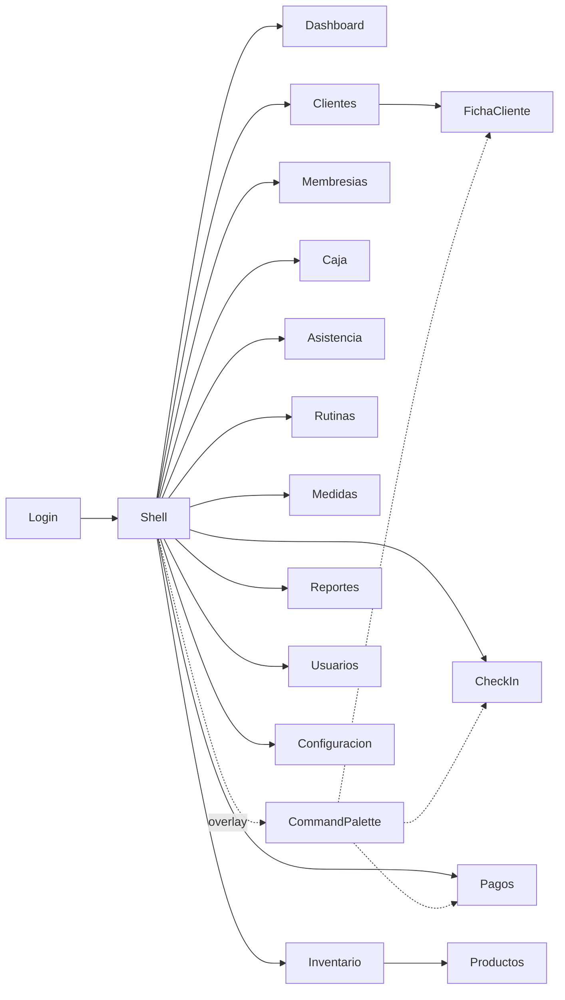

# 06 · Flujos de usuario y mapa de navegación

> Entregables 8 y 9.

## 1. Flujo crítico: Check-in (< 10 s)



Claves de diseño:
- El campo de búsqueda tiene **foco por defecto** al abrir la pantalla; el
  recepcionista escribe sin tocar el mouse.
- La validación es **local** (los datos del member ya están en caché offline),
  por eso es instantánea y funciona sin red.
- El registro es **optimista**: se pinta el resultado y se encola la escritura.
- Tras registrar, el foco **vuelve solo** al buscador para el siguiente cliente.

## 2. Flujo: Registrar pago + renovar



## 3. Flujo: Apertura y cierre de caja



## 4. Flujo: Alta de cliente (sin fricción)

Formulario inteligente en **un sheet**, no una página: solo Nombre + Teléfono son
obligatorios; el resto es progresivo. Foto opcional (cámara o archivo). Al
guardar, ofrece asignar plan en el mismo flujo (acción encadenada), evitando
navegar entre pantallas.

## 5. Mapa de navegación



## 6. Estructura de rutas (React Router)

```
/login
/                         → Dashboard (index)
/check-in                 → pantalla dedicada de mostrador
/members                  → lista + búsqueda
/members/:memberId        → ficha (con tabs internas)
/memberships
/payments
/cashbox                  → caja del turno actual
/attendance
/routines
/measurements
/inventory
/products
/reports
/settings/users
/settings                 → configuración de la organización
```

Navegación: sidebar colapsable (desktop-first), reducido a barra inferior/hamburguesa
en tablet/móvil. **Command palette** transversal (Cmd/Ctrl-K) como acelerador
principal: buscar cliente y disparar acciones desde cualquier pantalla.

## 7. Jerarquía de cada pantalla (las 3 preguntas del brief)

Cada vista responde inmediatamente:
- **¿Qué puedo hacer aquí?** → una barra de título con la acción primaria a la derecha.
- **¿Qué es lo más importante?** → primer bloque = dato/acción de mayor valor
  (ej. buscador en Check-in, indicadores accionables en Dashboard).
- **¿Cuál es la siguiente acción?** → CTA evidente y única; acciones secundarias
  en menú "…".
